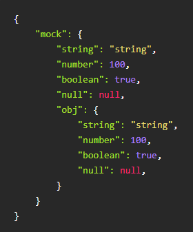

# JsonSyntaxHighlightInHtml
Json SyntaxHighlight In Html，HTML中的JSON语法高亮显示。

## 使用方法

### 1. 安装
```
npm i JsonSyntaxHighlightInHtml -D
cnpm i JsonSyntaxHighlightInHtml -D
yarn add JsonSyntaxHighlightInHtml -D
```

### 2. 页面调用
1. HTML
```
<pre class="JsonSyntaxHighlightInHtml"></pre>

const JsonSyntaxHighlightInHtml = require('JsonSyntaxHighlightInHtml');
document.querySelector('div.pages_test').innerText = JsonSyntaxHighlightInHtml();
```
2. Vue
```
<pre class="JsonSyntaxHighlightInHtml" v-html="preJson"></pre>

const JsonSyntaxHighlightInHtml = require('JsonSyntaxHighlightInHtml');
computed:{
    preJson(){
        return JsonSyntaxHighlightInHtml();
    }
}
```
3. React
```
<pre className="JsonSyntaxHighlightInHtml">{this.preJson}</pre>

const JsonSyntaxHighlightInHtml = require('JsonSyntaxHighlightInHtml');
constructor(props) {
    super(props);
    this.preJson = '';
}
get preJson() {
    return JsonSyntaxHighlightInHtml()
}
```
4. 预览

